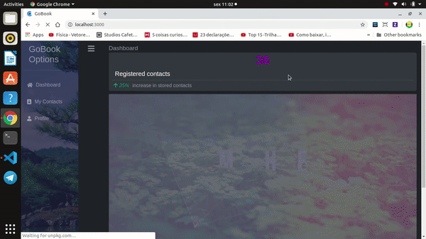
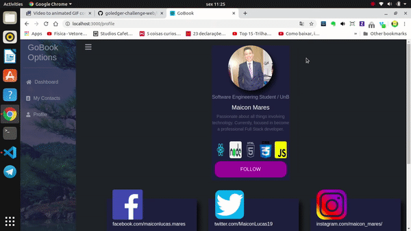

# GoBook
## About
An application built with ReactJS, HTML5, CSS3, Axios and other libraries. It's a responsive web application that works well in desktops and notebooks as also in mobile phones much small. The purpose of this app is win the GoLedger Challenge and learn more about software development.
## Application working in image below.

  

  

<h3>A responsive application made for large and small screens:</h3>

  

## Getting started
### Prerequisites

1. Git
2. Yarn: see <a href="https://classic.yarnpkg.com/en/docs/install/#windows-stable">yarn website for installation instructions</a>
3. Node: any 12.x version starting with 12.0 or greater
4. A fork of this repo
5. ReactJS: see <a href="https://reactjs.org/docs/getting-started.html">ReactJS.org for installation in your local machine</a>

### Installation - frontend
1. clone this repository.
2. cd /frontend to go to the frontend directory.
2. run **_yarn_** to install the npm dependencies

### Running locally
#### Frontend
1. Inside /frontend directory, run **_yarn start_** to start the development server. After, automatically a web page will opened in your browser.

## Observations

  
<i>:warning:</i> It's probably, sometimes, you will can't access imediatelly to data and you will need be patien, because some OPEN API's can take time to respond a request. But it takes seconds in the worst case.
  

Note</h2>

- I will really enjoy if you fork my repository, make pull requests and give me tips about how I can improve my software engineering skills. Thanks GoLedger for this challenge!

- There are simple documents about this application inside Wiki directory. If you are curious take a look!

